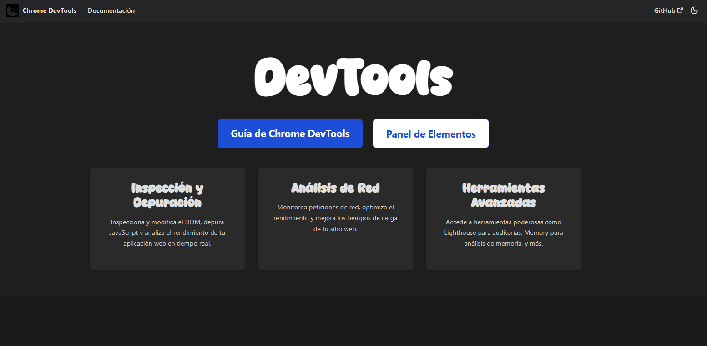

# 🛠️ Website - DevTools Docs



Este sitio es parte de un nuevo proyecto enfocado en documentación técnica, creado con [Docusaurus](https://docusaurus.io/), ideal para herramientas relacionadas con el desarrollo web.

---

## 🔍 ¿Qué es?

Una guía interactiva y moderna sobre cómo aprovechar al máximo el **inspector de elementos**, una de las herramientas más potentes del navegador para desarrolladores.  
Explorá cómo analizar, editar y depurar el DOM y los estilos CSS directamente desde el navegador, optimizando tu flujo de trabajo como dev.

---


### Installation

```
$ yarn
```

### Local Development

```
$ yarn start
```

This command starts a local development server and opens up a browser window. Most changes are reflected live without having to restart the server.

### Build

```
$ yarn build
```

This command generates static content into the `build` directory and can be served using any static contents hosting service.

### Deployment

Using SSH:

```
$ USE_SSH=true yarn deploy
```

Not using SSH:

```
$ GIT_USER=<Your GitHub username> yarn deploy
```

If you are using GitHub pages for hosting, this command is a convenient way to build the website and push to the `gh-pages` branch.


# Github Pages

Clic here: [https://andreblv.github.io/docusaurus](https://andreblv.github.io/docusaurus).

# Cpanel

Clic here: [https://916655924.facturalo.co/docusaurus/](https://916655924.facturalo.co/docusaurus/).
