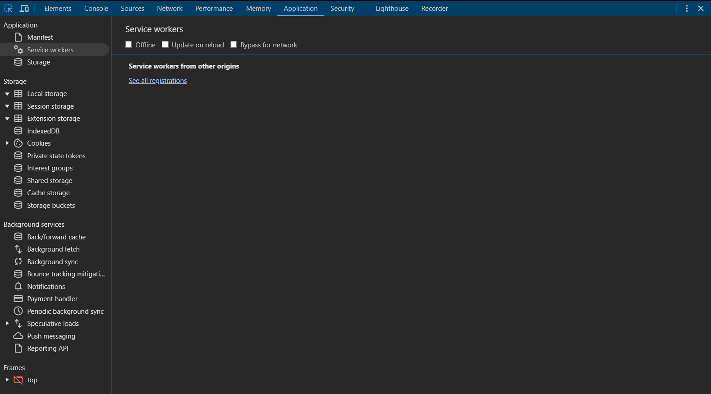

# Panel de Aplicación

El Panel de Aplicación te ayuda a inspeccionar y gestionar el almacenamiento, características de Aplicaciones Web Progresivas (PWA) y otros recursos del navegador.

## Gestión de Almacenamiento

### Local Storage
- Ver y editar pares clave-valor
- Eliminar elementos individuales
- Borrar todo el almacenamiento
- Filtrar elementos
- Monitorear cambios

### Session Storage
- Inspeccionar datos de sesión
- Modificar valores de sesión
- Limpiar almacenamiento de sesión
- Comparar con local storage
- Depurar estado de sesión

### Cookies
- Ver todas las cookies
- Editar propiedades de cookies
- Añadir nuevas cookies
- Eliminar cookies
- Filtrar por dominio

### IndexedDB
- Explorar bases de datos
- Ver almacenes de objetos
- Consultar datos indexados
- Limpiar bases de datos
- Monitorear transacciones

## Aplicaciones Web Progresivas

### Service Workers
- Ver workers registrados
- Verificar estado del worker
- Depurar scripts de worker
- Probar modo offline
- Limpiar caché del worker

### Manifiesto
- Inspeccionar manifiesto web
- Validar contenido del manifiesto
- Verificar iconos
- Probar instalabilidad
- Depurar características PWA

### Almacenamiento en Caché
- Ver recursos en caché
- Inspeccionar contenido de caché
- Eliminar entradas de caché
- Probar acceso offline
- Depurar estrategias de caché

## Almacenamiento Web

### Cuotas de Almacenamiento
- Ver uso de almacenamiento
- Verificar espacio disponible
- Monitorear límites de cuota
- Limpiar datos del sitio
- Depurar problemas de almacenamiento

### Servicios en Segundo Plano
- Ver sincronización en segundo plano
- Verificar mensajes push
- Monitorear sincronización periódica
- Depurar tareas en segundo plano
- Probar notificaciones

## Marcos

### Inspección de Marcos
- Ver jerarquía de marcos
- Inspeccionar detalles de marcos
- Verificar orígenes de marcos
- Depurar problemas cross-origin
- Monitorear recursos de marcos

### Recursos de Marcos
- Ver activos de marcos
- Verificar carga de recursos
- Depurar rendimiento de marcos
- Monitorear estado de marcos
- Probar interacciones de marcos

## Mejores Prácticas

### Gestión de Almacenamiento
1. Limpieza regular de datos no usados
2. Implementar límites de almacenamiento
3. Usar tipos de almacenamiento apropiados
4. Monitorear uso de almacenamiento
5. Implementar expiración de datos

### Desarrollo PWA
- Probar funcionalidad offline
- Validar service workers
- Verificar requisitos del manifiesto
- Monitorear estrategia de caché
- Probar flujo de instalación

## Vista de la aplicación
