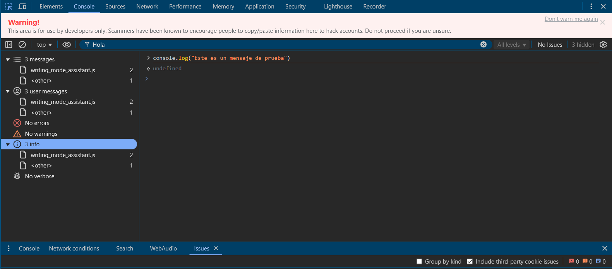

# Panel de Consola

El Panel de Consola es tu centro de comando para depuración de JavaScript, registro y ejecución de código en tiempo real.

## Uso Básico

### Mensajes de Consola
- Ver errores (rojo)
- Ver advertencias (amarillo)
- Ver mensajes de información (azul)
- Ver mensajes de depuración (gris)
- Filtrar mensajes por nivel o fuente

### Ejecución de Código
- Escribir y ejecutar JavaScript directamente
- Edición multilínea con Shift+Enter
- Acceder a variables en el ámbito actual
- Usar `$0` para referenciar el elemento seleccionado
- Limpiar consola con Ctrl+L o `console.clear()`

## Métodos Avanzados de Consola

### Métodos de Registro
```javascript
console.log('Registro básico')
console.info('Mensaje de información')
console.warn('Mensaje de advertencia')
console.error('Mensaje de error')
console.debug('Mensaje de depuración')
```

### Visualización de Datos
```javascript
console.table(arrayObjeto) // Mostrar datos en formato tabla
console.dir(objeto) // Mostrar propiedades del objeto
console.group('Nombre Grupo') // Crear grupos colapsables
console.time('Temporizador') // Iniciar temporizador
console.timeEnd('Temporizador') // Finalizar y mostrar temporizador
```

### Aserciones y Conteo
```javascript
console.assert(condicion, mensaje) // Registrar si la condición es falsa
console.count(etiqueta) // Contar ocurrencias
console.countReset(etiqueta) // Reiniciar contador
```

## Características de la API de Consola

### Expresiones en Vivo
- Fijar expresiones para monitorear valores
- Actualización en tiempo real
- Excelente para depurar cambios de estado

### Utilidades de Consola
- `$()` - querySelector()
- `$$()` - querySelectorAll()
- `$_` - Último resultado evaluado
- `$0` a `$4` - Elementos seleccionados recientemente
- `copy()` - Copiar al portapapeles

## Consejos de Rendimiento

### Agrupación y Formato
- Usar console.group() para logs relacionados
- Estilizar mensajes de consola con CSS
- Usar console.table() para arrays/objetos
- Crear formateadores de consola personalizados

### Trucos de Depuración
1. Usar puntos de interrupción condicionales
2. Registrar trazas de pila con console.trace()
3. Monitorear eventos con monitorEvents()
4. Crear expresiones en vivo
5. Usar async/await en la consola

## Mejores Prácticas
- Limpiar la consola al iniciar nueva sesión de depuración
- Usar niveles de registro apropiados
- Agrupar mensajes relacionados
- Etiquetar temporizadores y contadores claramente
- Evitar console.log en código de producción

## Vista de la consola
