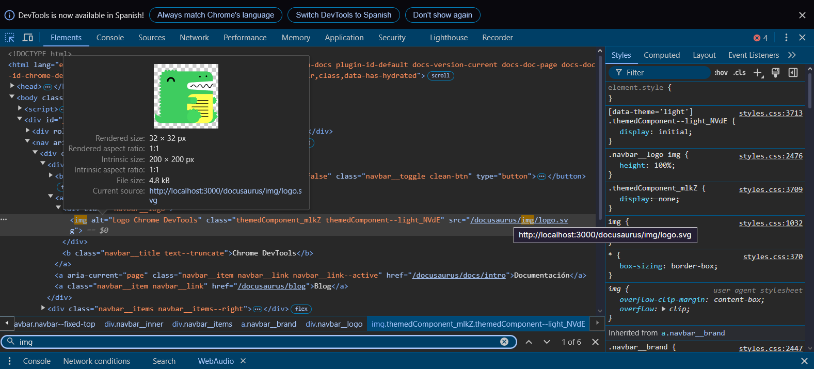

# Panel de Elementos

El Panel de Elementos es tu herramienta principal para inspeccionar y modificar el DOM y CSS de una página web en tiempo real.

## Inspección de Elementos

### Navegación del DOM
- Usa el ratón o Ctrl+Shift+C para inspeccionar elementos
- Navega el árbol DOM usando teclas de flecha
- Clic derecho para acciones contextuales
- Busca elementos usando Ctrl+F

### Manipulación del DOM
- Edita HTML directamente haciendo doble clic
- Elimina nodos con la tecla Delete
- Arrastra para reordenar elementos
- Copia/pega elementos dentro del árbol
- Oculta elementos con la tecla H

## Características CSS

### Panel de Estilos
- Ver y editar estilos en tiempo real
- Alternar propiedades individuales
- Añadir nuevas reglas CSS
- Filtrar estilos por tipo
- Copiar declaraciones CSS

### Modelo de Caja
- Visualiza y edita márgenes, bordes y padding
- Haz clic en números para editar dimensiones
- Shift+Clic para incrementar de 10 en 10
- Alt+Clic para incrementar de 0.1 en 0.1

### Pestaña Calculado
- Ver estilos finales calculados
- Ver herencia de estilos
- Encontrar origen de estilos
- Filtrar propiedades

## Estados de Elementos
- Alternar estados :hover, :active, :focus
- Forzar estados para pruebas
- Ver estilos específicos de estado

## Event Listeners
- Ver event listeners adjuntos
- Ver código fuente del listener
- Habilitar/deshabilitar listeners
- Depurar manejo de eventos

## Mejores Prácticas
1. Usar selector de color para colores precisos
2. Guardar snippets comúnmente usados
3. Usar modo dispositivo para pruebas responsive
4. Aprovechar herramientas de CSS Grid/Flexbox
5. Utilizar el panel de Accesibilidad para auditorías a11y

## Accesibilidad

### Panel de Accesibilidad
- Ver árbol de accesibilidad
- Comprobar contraste de color
- Verificar nombres y roles ARIA
- Inspeccionar orden de tabulación
- Validar atributos de accesibilidad

### Herramientas de Prueba
- Emular deficiencias visuales
- Verificar navegación por teclado
- Comprobar etiquetas y descripciones
- Validar roles y estados ARIA
- Analizar estructura de encabezados

## Dispositivos Móviles

### Modo Responsive
- Emular diferentes dispositivos
- Configurar dimensiones personalizadas
- Probar orientaciones
- Simular condiciones de red
- Verificar media queries

### Emulación de Dispositivo
- Simular touch events
- Probar geolocalización
- Emular sensores
- Configurar user agent
- Probar características específicas del dispositivo

## Depuración

### Cambios en Tiempo Real
- Ver cambios de DOM en directo
- Monitorear mutaciones
- Depurar reflows
- Analizar rendimiento de cambios
- Validar actualizaciones dinámicas

### Herramientas Avanzadas
- Romper en cambios del DOM
- Monitorear modificaciones
- Depurar layouts
- Verificar pintado
- Analizar capas

## Vista General del Panel

La imagen muestra las principales características del Panel de Elementos que hemos cubierto:

1. **Depuración**: Herramientas para analizar y depurar cambios en el DOM
2. **Cambios en Tiempo Real**: Capacidad para ver y monitorear modificaciones en directo
3. **Herramientas Avanzadas**: Funcionalidades para depuración profunda y análisis

### Funcionalidades Destacadas
- Ver cambios de DOM en directo
- Monitorear mutaciones
- Depurar reflows
- Analizar rendimiento de cambios
- Validar actualizaciones dinámicas