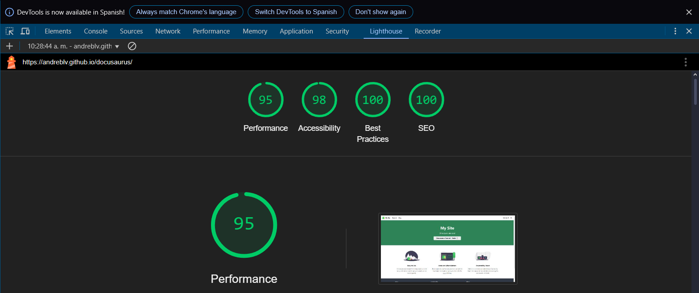

# Panel de Lighthouse

Lighthouse es una herramienta automatizada para mejorar la calidad de las páginas web. Proporciona auditorías de rendimiento, accesibilidad, aplicaciones web progresivas, SEO y más.

## Vista 

## Ejecutar Auditorías

### Opciones de Configuración
- Elegir categorías de auditoría
- Seleccionar emulación de dispositivo
- Configurar limitación de red
- Establecer opciones de limpieza de almacenamiento
- Habilitar plugins

### Categorías
1. **Rendimiento**
   - Velocidad de carga
   - Optimización de recursos
   - Eficiencia en tiempo de ejecución
   - Core Web Vitals

2. **Accesibilidad**
   - Implementación ARIA
   - Contraste de color
   - Navegación por teclado
   - Soporte para lectores de pantalla

3. **Mejores Prácticas**
   - Compatibilidad con navegadores
   - Medidas de seguridad
   - Características web modernas
   - Manejo de errores

4. **SEO**
   - Meta etiquetas
   - Capacidad de rastreo
   - Adaptación a móviles
   - Datos estructurados

5. **Aplicación Web Progresiva**
   - Capacidad de instalación
   - Service worker
   - Capacidad offline 
   - Características tipo app

## Métricas de Rendimiento

### Core Web Vitals
- First Contentful Paint (FCP)
- Largest Contentful Paint (LCP)
- Cumulative Layout Shift (CLS)
- First Input Delay (FID)
- Time to Interactive (TTI)
- Total Blocking Time (TBT)

### Oportunidades
- Optimización de imágenes
- Minificación de recursos
- Políticas de caché
- Compresión de texto
- Priorización de recursos

## Pruebas de Accesibilidad

### Verificaciones Comunes
- Ratios de contraste de color
- Atributos ARIA
- Jerarquía de encabezados
- Texto alternativo
- Gestión del foco

### Mejores Prácticas
1. Marcado semántico adecuado
2. Navegación por teclado
3. Soporte para lectores de pantalla
4. Etiquetas y controles de formulario
5. Contraste de color suficiente

## Optimización SEO

### SEO Técnico
- Meta descripciones
- Etiquetas de título
- Robots.txt
- Sitemap.xml
- Datos estructurados

### Optimización de Contenido
- Adaptación a móviles
- Enlaces descriptivos
- Estructura de encabezados
- Texto alternativo de imágenes
- Estructura de URLs

## Mejores Prácticas

### Consejos de Implementación
- Auditorías regulares
- Comparación de versiones
- Presupuestos de rendimiento
- Objetivos de accesibilidad
- Listas de verificación SEO

### Problemas Comunes
- Imágenes sin optimizar
- Meta etiquetas faltantes
- Bajo rendimiento
- Violaciones de accesibilidad
- Requisitos de PWA

## Análisis de Informes

### Comprensión de Puntuaciones
- Cálculo de puntuación
- Pesos por categoría
- Umbrales de métricas
- Puntuación de rendimiento
- Evaluación de impacto

### Plan de Acción
- Priorizar correcciones
- Seguir mejoras
- Documentar cambios
- Establecer referencias
- Monitorear progreso