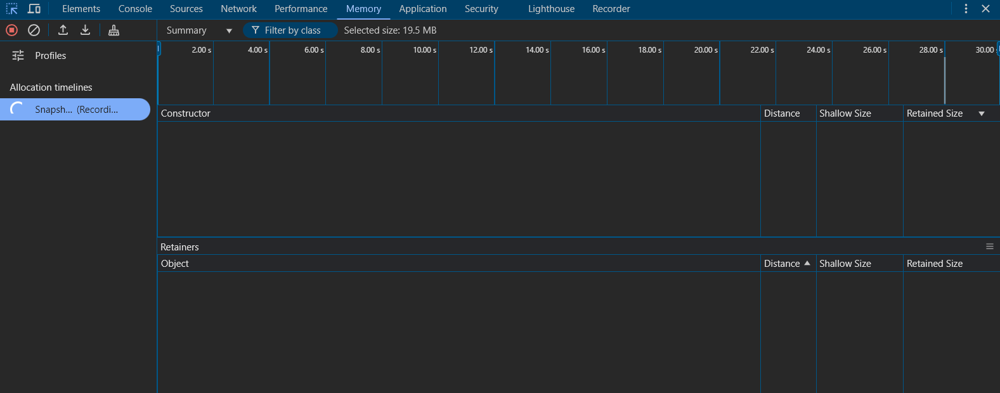

# Panel de Memoria

El Panel de Memoria proporciona herramientas para analizar el uso de memoria JavaScript, encontrar fugas de memoria y entender los patrones de asignación de memoria.

## Vista de la memoria

## Instantáneas de Memoria

### Toma de Instantáneas
- Clic en el botón de grabar para tomar una instantánea del montón
- Las instantáneas muestran el uso de memoria en un momento específico
- Comparar instantáneas para encontrar fugas de memoria
- Ver rutas de retención de objetos
- Analizar distribución de memoria

### Tipos de Instantáneas
1. **Instantánea del Montón**
   - Ver uso de memoria por constructor
   - Analizar referencias de objetos
   - Encontrar elementos DOM desconectados
   - Identificar fugas de memoria

2. **Instrumentación de Asignación**
   - Rastrear asignaciones de objetos JS
   - Ver línea de tiempo de asignación
   - Encontrar sitios frecuentes de asignación
   - Depurar churning de memoria

3. **Muestreo de Asignación**
   - Perfilado con menor sobrecarga
   - Muestrear asignaciones de memoria
   - Ver trazas de pila de asignación
   - Identificar patrones de asignación

## Análisis de Memoria

### Distribución de Memoria
- Ver uso de memoria por tipo
- Analizar grupos de constructores
- Encontrar cadenas duplicadas
- Identificar arrays grandes
- Rastrear referencias DOM

### Fugas de Memoria
- Comparar instantáneas
- Encontrar objetos crecientes
- Rastrear nodos DOM desconectados
- Analizar cadenas de clausuras
- Depurar fugas de event listeners

## Problemas Comunes

### Patrones de Memoria
- Arrays o colecciones crecientes
- Cachés sin límites
- Árboles DOM desconectados
- Referencias circulares
- Acumulación de event listeners

### Impacto en Rendimiento
- Recolección de basura frecuente
- Alta presión de memoria
- Ralentización de página
- Crashes de pestañas
- Errores de memoria insuficiente

## Mejores Prácticas

### Gestión de Memoria
1. Limpiar referencias innecesarias
2. Usar referencias débiles cuando sea apropiado
3. Implementar limpieza adecuada
4. Monitorear crecimiento de memoria
5. Perfilar memoria regularmente

### Consejos de Depuración
- Tomar instantáneas antes/después de operaciones
- Buscar diferencias de tamaño retenido
- Revisar elementos desconectados
- Monitorear línea de tiempo de asignación
- Documentar patrones de memoria

## Características Avanzadas

### Diferencias de Montón
- Comparar múltiples instantáneas
- Rastrear crecimiento de memoria
- Identificar fuentes de fugas
- Analizar rutas de retención
- Depurar regresiones de memoria

### Línea de Tiempo de Memoria
- Grabar patrones de asignación
- Ver recolección de basura
- Rastrear presión de memoria
- Analizar churning de memoria
- Depurar picos de memoria