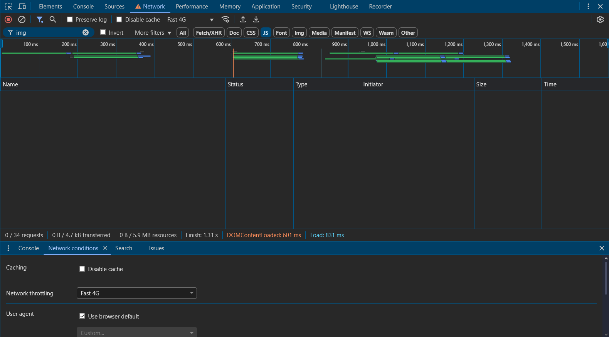

# Panel de Red

El Panel de Red te permite monitorear y analizar las peticiones de red para optimizar el rendimiento de carga.

## Monitor de Peticiones

### Vista General
- Ver todas las peticiones de red
- Analizar tiempos de carga
- Inspeccionar cabeceras HTTP
- Examinar respuestas
- Filtrar por tipo de recurso

## Vista de la red

### Línea de Tiempo
- Cascada de peticiones
- Tiempo de inicio
- Tiempo de espera (TTFB)
- Duración de descarga
- Tiempos de bloqueo

## Análisis de Recursos

### Tipos de Contenido
- Documentos HTML
- Hojas de estilo (CSS)
- Scripts (JavaScript)
- Imágenes
- Fuentes
- Otros recursos

### Detalles de Petición
- Método HTTP
- Códigos de estado
- Tipo de contenido
- Tamaño de transferencia
- Tamaño de recurso

## Optimización

### Herramientas de Rendimiento
- Throttling de red
- Caché deshabilitada
- Emulación de conexión
- Preservar registro
- Exportar HAR

### Métricas Importantes
- Tiempo de carga
- Tiempo de dominio
- Tiempo de conexión
- Tiempo SSL
- Tiempo de respuesta

## Depuración

### Inspección de Cabeceras
- Cabeceras de petición
- Cabeceras de respuesta
- Cookies
- Parámetros de consulta
- Datos de formulario

### Análisis de Contenido
- Vista previa
- Respuesta
- Tiempos
- Cookies
- WebSocket

## Mejores Prácticas

### Optimización de Carga
1. Minimizar peticiones
2. Comprimir recursos
3. Utilizar caché
4. Priorizar recursos críticos
5. Implementar lazy loading

### Monitoreo
- Registrar actividad de red
- Analizar cuellos de botella
- Validar optimizaciones
- Comparar rendimiento
- Documentar problemas

## Características Avanzadas

### Filtrado
- Por tipo de recurso
- Por dominio
- Por estado
- Por tamaño
- Por tiempo

### Personalización
- Columnas personalizadas
- Ordenamiento
- Agrupación
- Búsqueda
- Exportación de datos