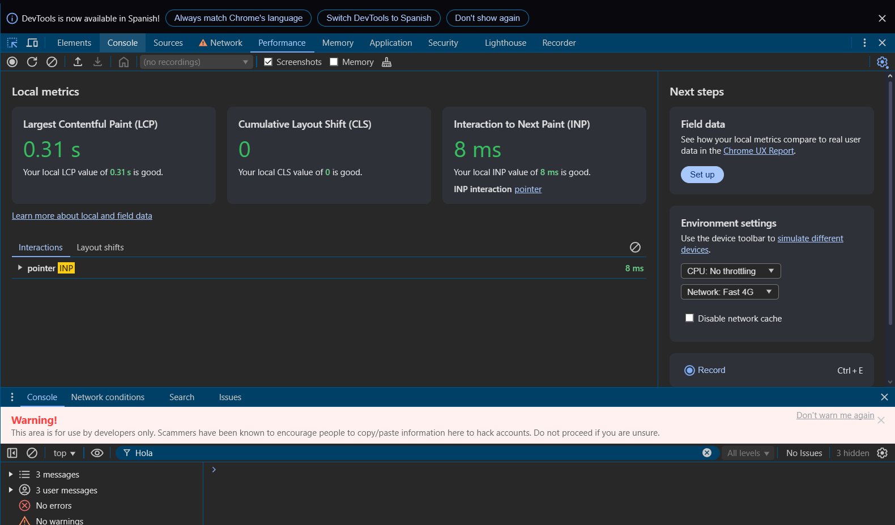

# Panel de Rendimiento

El Panel de Rendimiento te ayuda a analizar el rendimiento en tiempo de ejecución e identificar cuellos de botella en tu aplicación web.

## Vista del rendimiento

## Grabación de Rendimiento

### Grabación Básica
- Clic en el botón grabar o Ctrl+E
- Realizar las acciones a analizar
- Detener la grabación para ver resultados
- Guardar grabaciones para comparación

### Ajustes de Grabación
- Habilitar capturas de pantalla
- Habilitar instrumentación de memoria
- Opciones de limitación de CPU
- Limitación de red
- Información de capas

## Análisis de Línea de Tiempo

### Vista General
- Medidor de FPS (cuadros por segundo)
- Gráfico de uso de CPU
- Línea de tiempo de peticiones de red
- Actividad del hilo principal
- Actividad de GPU

### Categorías de Eventos
- Eventos de carga
- Actividades de scripts
- Operaciones de renderizado
- Tareas de pintado
- Eventos del sistema
- Media queries

## Gráfico de Llama

### Hilo Principal
- Ver pila de llamadas
- Identificar tareas largas
- Analizar ejecución JavaScript
- Encontrar código que bloquea el renderizado
- Depurar manejadores de eventos

### Fotogramas
- Analizar tasa de fotogramas
- Identificar fotogramas perdidos
- Ver detalles de fotogramas
- Depurar problemas de animación
- Optimizar renderizado

## Gestión de Memoria

### Métricas de Memoria
- Tamaño del montón JS
- Conteo de nodos DOM
- Event listeners
- Ciclo de vida del documento
- Operaciones de layout

### Línea de Tiempo de Memoria
- Rastrear asignaciones
- Identificar fugas de memoria
- Monitorear recolección de basura
- Analizar crecimiento de memoria
- Depurar problemas de memoria

## Información de Rendimiento

### Problemas Comunes
- Tareas largas bloqueando el hilo principal
- Tamaño excesivo del DOM
- Thrashing de layout
- Imágenes no optimizadas
- Cuellos de botella en JavaScript

### Consejos de Optimización
1. Minimizar trabajo en el hilo principal
2. Reducir tiempo de ejecución JavaScript
3. Optimizar pipeline de renderizado
4. Implementar delegación de eventos apropiada
5. Usar requestAnimationFrame para animaciones

## Mejores Prácticas

### Grabación
- Usar modo incógnito para resultados limpios
- Deshabilitar extensiones durante pruebas
- Grabar múltiples muestras
- Enfocarse en acciones específicas
- Documentar hallazgos

### Análisis
- Buscar patrones en gráficos de llama
- Identificar cuellos de botella recurrentes
- Comparar antes/después de optimizaciones
- Enfocarse en problemas que afectan al usuario
- Medir contra presupuestos de rendimiento