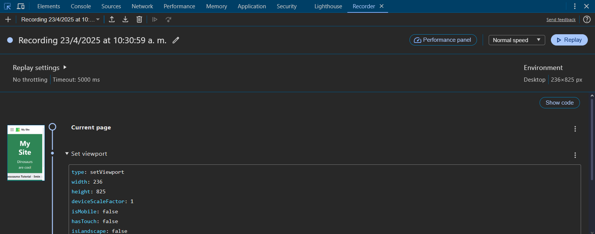

# Panel de Grabación

El Panel de Grabación te permite grabar, reproducir y medir flujos de usuario a través de tu sitio web, ayudando con pruebas y análisis de rendimiento.

## Vista de la consola

## Grabación de Flujos de Usuario

### Grabación Básica
- Iniciar una nueva grabación
- Realizar interacciones de usuario
- Detener y guardar grabación
- Añadir pasos personalizados
- Exportar grabación

### Opciones de Grabación
- Capturar clics del ratón
- Grabar entrada de teclado
- Rastrear interacciones de formulario
- Monitorear navegación
- Grabar estados hover

## Gestión de Grabaciones

### Grabaciones Guardadas
- Organizar grabaciones
- Editar pasos grabados
- Añadir aserciones
- Establecer condiciones de espera
- Compartir grabaciones

### Opciones de Reproducción
- Controlar velocidad de reproducción
- Reproducción paso a paso
- Anular tiempos de espera
- Manejar contenido dinámico
- Depurar fallos

## Generación de Pruebas

### Formatos de Exportación
- Scripts de Puppeteer
- Pruebas de Playwright
- Grabaciones JSON
- Chrome DevTools Replay
- Formatos personalizados

### Personalización de Pruebas
- Añadir aserciones
- Modificar selectores
- Manejar autenticación
- Establecer tiempos de espera
- Añadir lógica personalizada

## Análisis de Rendimiento

### Medición de Flujos
- Cronometrar flujos de usuario
- Rastrear tiempos de carga
- Medir interacciones
- Comparar variaciones
- Identificar cuellos de botella

### Recolección de Métricas
- Core Web Vitals
- Tiempos personalizados
- Interacciones de usuario
- Peticiones de red
- Ejecución de JavaScript

## Características Avanzadas

### Selectores Personalizados
- Selectores XPath
- Selectores CSS
- Selectores de texto
- Selectores ARIA
- Estrategias de selector personalizadas

### Manejo de Errores
- Gestión de tiempos de espera
- Mecanismos de reintento
- Recuperación de errores
- Contenido dinámico
- Validación de estado

## Mejores Prácticas

### Consejos de Grabación
1. Planificar el flujo de usuario
2. Usar nombres claros
3. Añadir comentarios descriptivos
4. Validar selectores
5. Probar casos límite

### Mantenimiento
- Validación regular de reproducción
- Actualizar selectores
- Documentar cambios
- Control de versiones
- Monitorear fallos

## Integración

### Pipeline CI/CD
- Pruebas automatizadas
- Monitoreo de rendimiento
- Detección de regresiones
- Validación de versiones
- Monitoreo continuo

### Flujo de Desarrollo
- Depurar problemas de usuario
- Validar características
- Probar accesibilidad
- Medir rendimiento
- Documentar flujos de trabajo