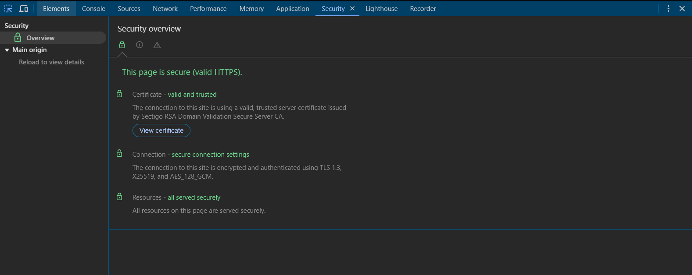

# Panel de Seguridad

El Panel de Seguridad te ayuda a verificar la seguridad de tu sitio y depurar problemas relacionados con certificados o HTTPS.

## Vista General

### Estado de Seguridad
- Ver estado general de seguridad
- Verificar implementación HTTPS
- Identificar contenido mixto
- Validar certificados
- Revisar cabeceras de seguridad

## Información del Certificado

### Detalles del Certificado
- Ver cadena de certificados
- Verificar período de validez
- Revisar detalles del emisor
- Verificar información del sujeto
- Comprobar fortaleza de encriptación

### Problemas de Certificados
- Identificar certificados expirados
- Depurar problemas de cadena
- Verificar estado de revocación
- Validar coincidencia de nombres de host
- Revisar problemas de confianza

## Seguridad de Conexión

### Detalles HTTPS
- Ver versión TLS
- Verificar conjunto de cifrado
- Revisar intercambio de claves
- Ver detalles del protocolo
- Comprobar fortaleza de conexión

### Contenido Mixto
- Identificar contenido mixto
- Encontrar recursos inseguros
- Depurar problemas de actualización
- Verificar política de contenido
- Solucionar advertencias de contenido mixto

## Cabeceras de Seguridad

### Cabeceras de Respuesta
- Ver cabeceras de seguridad
- Verificar implementación CSP
- Comprobar configuración HSTS
- Revisar cabeceras CORS
- Verificar protección XSS

### Cabeceras Comunes
1. Content-Security-Policy
2. Strict-Transport-Security
3. X-Content-Type-Options
4. X-Frame-Options
5. X-XSS-Protection

## Mejores Prácticas

### Lista de Verificación de Seguridad
- Implementar HTTPS en todo el sitio
- Usar cookies seguras
- Habilitar cabeceras de seguridad
- Evitar contenido mixto
- Mantener certificados actualizados

### Consejos de Depuración
- Verificar cadena de certificados
- Comprobar nombres de dominio
- Revisar políticas de seguridad
- Probar en diferentes navegadores
- Monitorear advertencias de seguridad

## Características Avanzadas

### Análisis de Origen
- Ver detalles de origen
- Verificar contexto seguro
- Depurar problemas de origen
- Verificar política same-origin
- Probar peticiones cross-origin

### Políticas de Seguridad
- Revisar reportes CSP
- Probar cambios de política
- Depurar violaciones de política
- Monitorear logs de seguridad
- Validar implementación de políticas