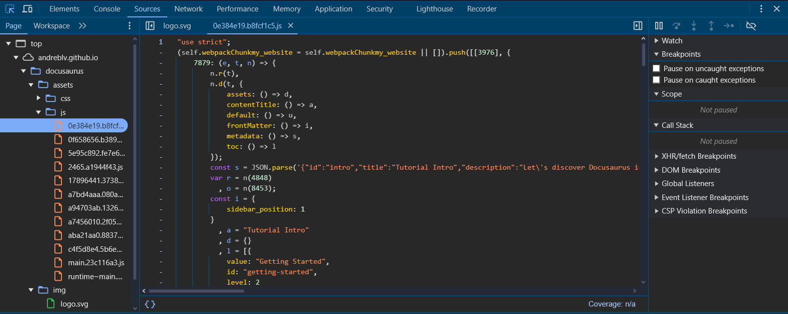

# Panel de Sources

El Panel de Sources es tu entorno de desarrollo integrado dentro de Chrome DevTools, proporcionando potentes capacidades de depuración para código JavaScript.

## Vista de la consola

## Navegación de Archivos

### Árbol de Archivos
- Explorar archivos fuente
- Buscar en todos los archivos
- Filtrar por nombre de archivo
- Agrupar por dominio
- Apertura rápida (Ctrl+P)

### Source Maps
- Depurar código minificado
- Mapear a fuentes originales
- Ver archivos preprocesados
- Navegar árbol de fuentes
- Saltar a definiciones

## Depuración

### Puntos de Interrupción
- Puntos de interrupción de línea
- Puntos de interrupción condicionales
- Puntos de registro
- Puntos de interrupción DOM
- Puntos de interrupción de event listener
- Puntos de interrupción de excepción

### Control de Ejecución
- Paso por encima (F10)
- Paso adentro (F11)
- Paso afuera (Shift+F11)
- Reanudar (F8)
- Pausar en excepciones
- Reiniciar marco

## Watch y Scope

### Inspección de Variables
- Expresiones watch
- Variables de ámbito
- Ámbito de clausura
- Ámbito global
- Contexto this

### Visualización de Datos
- Propiedades de objeto
- Contenido de arrays
- Detalles de función
- Estado de promesas
- Valores de iterador

## Pila de Llamadas

### Navegación de Pila
- Ver jerarquía de llamadas
- Saltar a fuente
- Ignorar scripts
- Trazas de pila asíncronas
- Llamadas de framework

### Información de Depuración
- Ámbito actual
- Razón de interrupción
- Contexto de hilo
- Operaciones asíncronas
- Hilos worker

## Snippets

### Gestión de Código
- Crear snippets
- Guardar scripts comunes
- Ejecutar snippets
- Auto-completado
- Persistencia entre sesiones

### Utilidades de Depuración
- Funciones de depuración
- Bloques de código de prueba
- Experimentos rápidos
- Funciones de utilidad
- Plantillas de código

## Características Avanzadas

### Workspaces
- Edición de archivos locales
- Mapeo de fuentes
- Recarga en vivo
- Configuración de proyecto
- Persistencia de archivos

### Herramientas de Depuración
- Pretty print
- Soporte de source maps
- Integración con consola
- Override de red
- Patrones de punto de interrupción

## Mejores Prácticas

### Flujo de Depuración
1. Establecer puntos de interrupción estratégicos
2. Usar expresiones watch
3. Revisar pila de llamadas
4. Monitorear cambios de ámbito
5. Avanzar por el código cuidadosamente

### Consejos de Rendimiento
- Usar puntos de interrupción condicionales
- Ignorar scripts irrelevantes
- Habilitar trazas de pila asíncronas
- Utilizar puntos de registro
- Agrupar puntos de interrupción relacionados